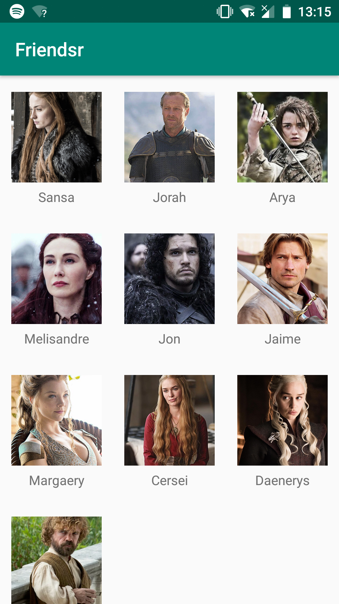
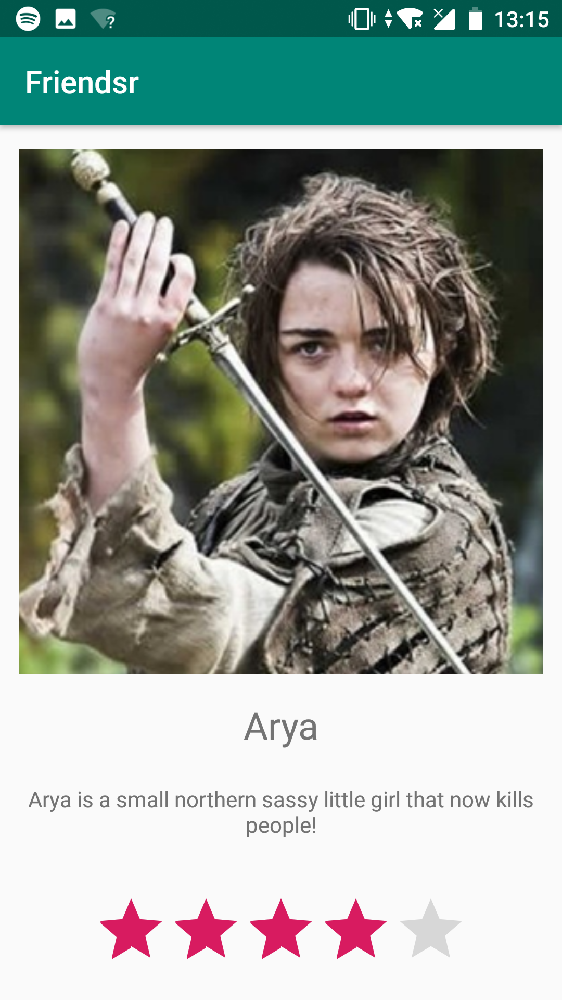
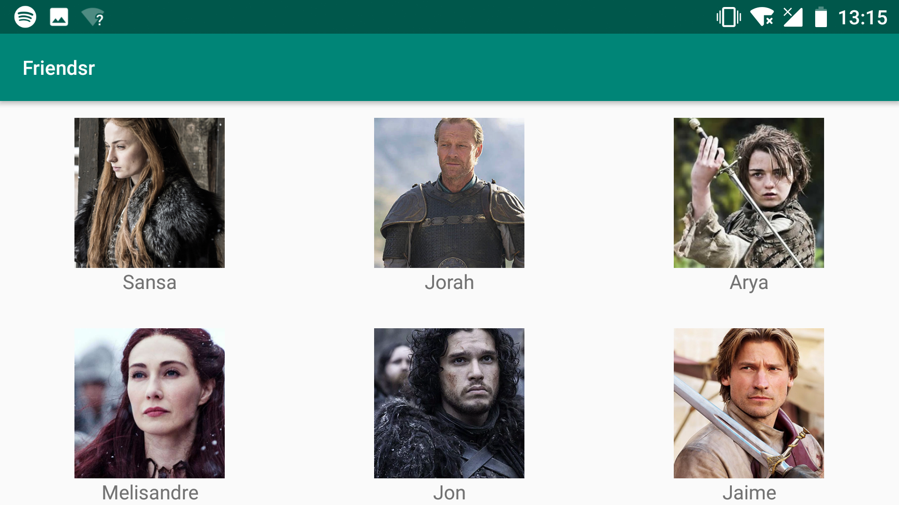

# Friendsr

## Author info
**Name:** Stefan Klut  
**Studentnumber:** 11331720  
**email:** stefanklut12@gmail.com

## Description
An app that lets you rate your friends (or in our case GoT characters). 
The starting interface is a grid with three columns that shows all the friends.
When one of the friends is clicked, the app shows a new interface with more detailed information.
On this screen is also a rating bar. The value of the rating that is given is saved, 
so that it isn't lost even if the phone is shut down.

## Screenshots

### Opening Screen:

### Detailed friend screen:

### Landscape mode:

